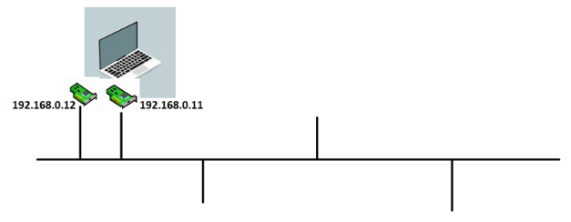

# Networking

=> Terms :

1. IP address : unique number given to a device in a network.It has two schemas :
  * IPv4
  * IPv6
* IPv4 is 32-bit, whereas IPv6 is 128-bit
* In IPv4, binary bits are separated by a dot (.); IPv6 separates binary bits by a colon (:)
* IPv4 follows the numeric addressing method and IPv6 is alphanumeric

2. Network interface : the point of interconnection between a computer and a private or public network
* A network interface is generally a network interface card (NIC), but does not have to have a physical form. Instead, the network interface can be implemented in software 

3. Network : A network consists of two or more computers that are linked in order to share resources, exchange files, or allow electronic communications
* The computers on a network may be linked through cables, telephone lines, radio waves, satellites, or infrared light beams
* Two very common types of networks include:

   1. Local Area Network (LAN)
   2. Wide Area Network (WAN)
* You may also see references to a Metropolitan Area Networks (MAN), a Wireless LAN (WLAN), or a Wireless WAN (WWAN)

4. Subnet : A subnet, or subnetwork, is a segmented piece of a larger network
* More specifically, subnets are a logical partition of an IP network into multiple, smaller network segments 
* The Internet Protocol (IP) is the method for sending data from one computer to another over the internet
* There are several types of routers, but most routers pass data between LANs (local area networks) and WANs (wide area networks)
* A LAN is a group of connected devices restricted to a specific geographic area
* A LAN usually requires a single router

5. Switching : Switching is process to forward packets coming in from one port to a port leading towards the destination * When data comes on a port it is called ingress, and when data leaves a port or goes out it is called egress
* A communication system may include number of switches and nodes

6. NAT (Network address translation) : is a method of mapping an IP address space into another by modifying network address information in the IP header of packets while they are in transit across a traffic routing device
* As network address translation modifies the IP address information in packets, NAT implementations may vary in their specific behavior in various addressing cases and their effect on network traffic

7. VPN (virtual private network) : It is a mechanism for creating a secure connection between a computing device and a computer network, or between two networks, using an insecure communication medium such as the public Internet
* VPN is created by establishing a virtual point-to-point connection through the use of tunneling protocols over existing networks

8. Gateway : A gateway is a node (router) in a computer network, a key stopping point for data on its way to or from other networks
* On the Internet, the node that’s a stopping point can be a gateway or a host node
* A computer that controls the traffic your Internet Service Provider (ISP) receives is a node

9. OSI Model (Open Systems Interconnection) : describes seven layers that computer systems use to communicate over a network
* The modern Internet is not based on OSI, but on the simpler TCP/IP model
* OSI 7-layer model is still widely used, as it helps visualize and communicate how networks operate, and helps isolate and troubleshoot networking problems
10. Load Balancing
11. DNS
12. Leased Lines
13. CoLO
14. public and private networks

 * subnets = 2^n -2

 * 2 => 0.0.0.0 => Network IP
     => 255.255.255 => Broadcast IP

## Private vs Public Network

=> Private Network: Network which cannot be accesed directly from internet
=> Public Network: Network which can be accessed from internet

* Private network cidr ranges :

=> 10.0.0.0/8: 10.0.0.0 to 10.255.255.255
=> 172.16.0.0/12: 172.16.0.0 -- 172.31.255.255
=> 192.168.0.0/16: 192.168.0.0 -- 192.168.255.255

* Here to know the bigger network : 
```
example
192.168.0.0/22 => hosts =32-22=10 => 2^10
192.168.0.0/24 => hosts =32-24=8 => 2^8
```
=> N (Network-ID) is always a fixed number
=> Network size = no.of host ID's ( So 22 is larger network than 24 ) 

## Subnets

* Subnet (sub networks) are parts of larger network

### Scenario

* Consider you need to create network with subnets for the following

1. A Building with 4 floors, Each floor requires 50 devices
```
each floor ~= 50
2^n ~= 50
n = 6
N = 32-6 = 26

building ~= 50 * 4 = 200
2^n ~= 200
n = 8
N = 24

10.0.0.0/8
172.16.0.0/12
192.168.0.0/16

building network: 192.168.0.0/24

BD SM: 11111111.11111111.11111111.00000000
FL SM: 11111111.11111111.11111111.11000000
----------------------------------------------
                                 .xx000000
                                 .00000000 => 192.168.0.0/26 (1st floor)
                                 .01000000 => 192.168.0.64/26 (2nd floor)
                                 .10000000 => 192.168.0.128/26 (3rd floor)
                                 .11000000 => 192.168.0.192/26 (4th floor)
```
* Each device requires 100 devices
```
each floor ~= 100
2^n ~= 100
n = 7
N = 25

building ~= 400
2^n ~= 400
n = 9
N = 23

10.0.0.0/8
172.16.0.0/12
192.168.0.0/16

172.16.0.0/23

BD SM: 11111111.11111111.11111110.00000000
FL SM: 11111111.11111111.11111111.10000000

----------------------------------------------
                                x.x0000000
                                0.00000000 => 172.16.0.0/25
                                0.10000000 => 172.16.0.128/25
                                1.00000000 => 172.16.1.0/25
                                1.10000000 => 172.16.1.128/25
```
* Each floor requires 30,000 devices
```
each floor ~= 30000
2^n ~= 30000
n = 15
N = 17

building ~= 120000
2^n ~= 120000
n = 17
N = 15

10.0.0.0/8
172.16.0.0/12

building: 10.0.0.0/15

BD SM: 11111111.11111110.00000000.00000000
FL SM: 11111111.11111111.10000000.00000000
  --------------------------------------------
                       x.x
                       0.00000000  => 10.0.0.0/17
                       0.10000000  => 10.0.128.0/17
                       1.00000000  => 10.1.0.0/17
                       1.10000000  => 10.1.128.0/17
```
2. Building with 8 floors

* Each floor requires 100 devices
```
each floor ~= 100
2^n ~= 100
n = 7
N = 25

building ~= 800
2^n ~= 800
n = 10
N = 22

10.0.0.0/8
172.16.0.0/12
192.168.0.0/16

bd: 192.168.0.0/22

BD SM: 11111111.11111111.11111100.00000000
FL SM: 11111111.11111111.11111111.10000000
--------------------------------------------
                               xx.x
                               00.00000000 => 192.168.0.0/25
                               00.10000000 => 192.168.0.128/25
                               01.00000000 => 192.168.1.0/25
                               01.10000000 => 192.168.1.128/25
                               10.00000000 => 192.168.2.0/25
                               10.10000000 => 192.168.2.128/25
                               11.00000000 => 192.168.3.0/25
                               11.10000000 => 192.168.3.128/25
```
* Each floor has 30,000 devices
```
each floor ~= 30,000
2^n ~30,000
n = 15
N = 17

building ~= 800
2^n ~= 800
n = 10
N = 22

10.0.0.0/8
172.16.0.0/12
192.168.0.0/16

bd: 172.16.0.0/22

BD SM: 11111111.11111111.11111100.00000000
FL SM: 11111111.11111111.10000000.00000000
--------------------------------------------
                          xxxxx     
                          00000    

                          11111     
```
* Each floor has 50 devices
```
each floor ~= 50
2^n ~= 50
n = 6
N = 32-6 = 26

building ~= 800
2^n ~= 800
n = 10
N = 22

10.0.0.0/8
172.16.0.0/12
192.168.0.0/16

building network: 192.168.0.0/26

BD SM: 11111111.11111111.11111100.00000000
FL SM: 11111111.11111111.11111111.11000000
----------------------------------------------
                               xx.xx  
                               0000  

                               1111
```
## Network Interface

* A device is connected to the network using Network interface



* The ip that the network interface recieves can be used to access the device/system/server
* A device can have multiple network interfaces
* Network interfaces gets an ip address assigned to it by DHCP (Dynamic Host Configuration Protocol) server


* In your home networks, wifi routers have built in DHCP which assigns the ip
* DHCP can assign dynamic ip or static ip depending on configuration.
* Interface gets the IPaddress whereas DHCP gives the IPaddress

## How can a private network access internet?

* Rule: Any server on public network will respond to other server in public network only.
* NAT (Network Address Translation) can help


## Rules in networking

* In networking we need to write rules (firewalls, routers, etc), Rules are designed to work with network id’s only
* Rules generally involve cidr ranges with focus on network id part

```
Specific network :

192.168.0.0/24
10.0.0.0/16

Any ip address :

0.0.0.0/0

specific ip address :

4.4.4.4/32
```
## Networking Concepts

* DNS (Domain Name Server):

   * DNS provides services which includes names to ip addresses (Domain names)
   * DNS Servers can be :
      1. public
      2. internal
* DNS Servers will have different record types :
      1. A Record: name to ip mapping
      2. CName Record: alias to name
      3. other record types : https://www.site24x7.com/learn/dns-record-types.html
* DNS can be setup on client system
    * windows: open 'c:\windows\system32\drivers\etc\hosts' and entries
    * other: open '/etc/hosts' and entries

* DNS Servers can help


* DNS Servers will have DNS zones
* DNS servers work on port 53

## Communication between two networks privately

* While communicating between two networks privately their ip ranges should not collide.
```
Case: non-colliding :

network A: 192.168.0.0/24 => 192.168.0.0 to 192.168.0.255
network B: 192.168.1.0/24 => 192.168.1.0 to 192.168.1.255

Case: colliding :

network A: 192.168.0.0/23 => 192.168.0.0 to 192.168.1.255
network B: 192.168.1.0/24 => 192.168.1.0 to 192.168.1.255
```
## Within same campus/site/datacenter

* Since the underlying network exists, we need to configure routing rules


## Across Cities

* Option 1: Leased lines


* Option 2: VPN (Virtual Private Networks)


[ * Note: Point to site (Work from home connection) ]


## AWS Global Infrastructure

* Region: Region is a Geographical location with Availability Zones (AZ). * * Each Region has a code and every AZ has an id
* Regions also have local zones which they can add as additional zones (AZ)
* Wavelength zones are 5G carrier network supported


* Edge Locations:

=> They help in establishing direct connectivity with AWS Global network (AWS Direct Connect)


=> Content Delivery Networks

## AWS Networking – VPC (Virtual Private Cloud)

* AWS VPC is a service for enabling network to AWS Resources


* In AWS Every Region will have a Default VPC created by AWS which has internet gateway. 
* All these days when you were creating ec2 instance you were using default vpc.

[Note: Never ever mess with default vpc.]

### Networking Components

=> VPC: This is a private network scoped to a region

=> Subnet: This is subnet part of some vpc scoped to AZ

=> Elastic network interface: This is network interface which assigns a private ip and private dns name to any resource connected (ec2)

=> Security Group: Rules around elastic network interface for incoming traffic (ingress) and outgoing traffic (egress)

=> Route Table: Router for a network. Every vpc will have a default route table. This route table comes into action if subnet doesnot have its own route table.

=> Internet Gateway: This provides dual internet access

## Experiment 1: Create a vpc with 3 subnets in 3 zones

* AWS resources do not have names, they have tags. Tag is Key value pair.
* Tag with Key = Name and value = something is generally shown as Name in UI (Console)
* AWS has a unique id for every resource which we create
* Lets create a vpc with 3 subnets