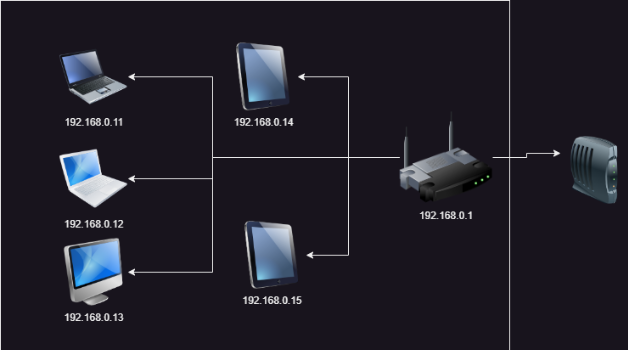
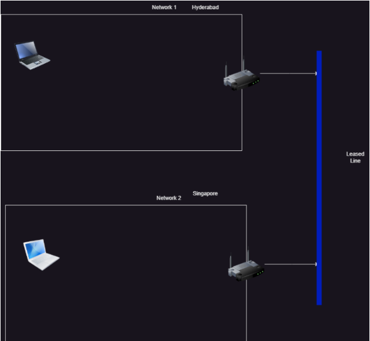
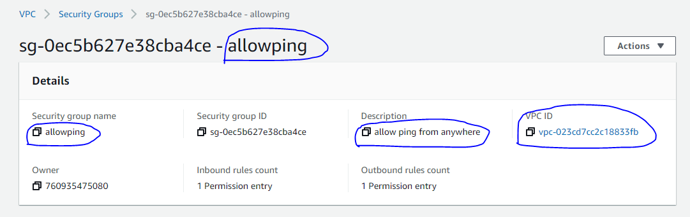
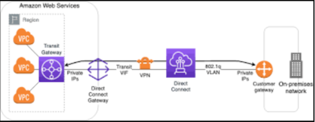

# Networking

=> Terms :

1. IP address : unique number given to a device in a network.It has two schemas :
  * IPv4
  * IPv6
* IPv4 is 32-bit, whereas IPv6 is 128-bit
* In IPv4, binary bits are separated by a dot (.); IPv6 separates binary bits by a colon (:)
* IPv4 follows the numeric addressing method and IPv6 is alphanumeric

2. Network interface : the point of interconnection between a computer and a private or public network
* A network interface is generally a network interface card (NIC), but does not have to have a physical form. Instead, the network interface can be implemented in software 

3. Network : A network consists of two or more computers that are linked in order to share resources, exchange files, or allow electronic communications
* The computers on a network may be linked through cables, telephone lines, radio waves, satellites, or infrared light beams
* Two very common types of networks include:

   1. Local Area Network (LAN)
   2. Wide Area Network (WAN)
* You may also see references to a Metropolitan Area Networks (MAN), a Wireless LAN (WLAN), or a Wireless WAN (WWAN)

4. Subnet : A subnet, or subnetwork, is a segmented piece of a larger network
* More specifically, subnets are a logical partition of an IP network into multiple, smaller network segments 
* The Internet Protocol (IP) is the method for sending data from one computer to another over the internet
* There are several types of routers, but most routers pass data between LANs (local area networks) and WANs (wide area networks)
* A LAN is a group of connected devices restricted to a specific geographic area
* A LAN usually requires a single router

5. Switching : Switching is process to forward packets coming in from one port to a port leading towards the destination * When data comes on a port it is called ingress, and when data leaves a port or goes out it is called egress
* A communication system may include number of switches and nodes

6. NAT (Network address translation) : is a method of mapping an IP address space into another by modifying network address information in the IP header of packets while they are in transit across a traffic routing device
* As network address translation modifies the IP address information in packets, NAT implementations may vary in their specific behavior in various addressing cases and their effect on network traffic

7. VPN (virtual private network) : It is a mechanism for creating a secure connection between a computing device and a computer network, or between two networks, using an insecure communication medium such as the public Internet
* VPN is created by establishing a virtual point-to-point connection through the use of tunneling protocols over existing networks

8. Gateway : A gateway is a node (router) in a computer network, a key stopping point for data on its way to or from other networks
* On the Internet, the node that’s a stopping point can be a gateway or a host node
* A computer that controls the traffic your Internet Service Provider (ISP) receives is a node

9. OSI Model (Open Systems Interconnection) : describes seven layers that computer systems use to communicate over a network
* The modern Internet is not based on OSI, but on the simpler TCP/IP model
* OSI 7-layer model is still widely used, as it helps visualize and communicate how networks operate, and helps isolate and troubleshoot networking problems

10. Load Balancing : Load balancing is the method of distributing network traffic equally across a pool of resources that support an application
* Modern applications must process millions of users simultaneously and return the correct text, videos, images, and other data to each user in a fast and reliable manner
* Load balancing directs and controls internet traffic between the application servers and their visitors or clients 
* As a result, it improves an application’s availability, scalability, security, and performance

11. DNS (Domain name system) : is a naming database in which internet domain names are located and translated into Internet Protocol (IP) addresses
* DNS translates domain names to IP addresses so browsers can load Internet resources
* Each device connected to the Internet has a unique IP address which other machines use to find the device

12. Leased Lines : leased line is an allocated circuit between two points of communication
* The leased lines are used by corporate offices, businesses, companies, internet cafes, and so on
* Basically, leased lines are used in all places that require an uninterrupted Internet connection for collaboration and communication activities

13. CoLO (Colo Hosting, Colocation Space, Colocation Server Hosting, or Colocation Data Center Space.) : A Colo is space provided in a data center for servers and equipment that can directly connect to Internet network backbones
* Colo is used by businesses to provide reliable, secure, redundant, Internet connectivity and space for websites, applications, and important data
* Most data centers offer additional managed network service and onsite support for all aspects of WAN connectivity and security
* Colo space is sold by the rack or cage with additional options for power, cooling, and data back-up available

14. public networks : A public network is an unrestricted network that’s accessible to the general public– like the Internet
* Because anyone can access this network, it comes with certain security risks
* The data over this type of open connection is often unencrypted, which makes it an enticing target for hackers

15. private networks : A private network is a network that uses a private space and can only be accessed by approved devices (Think of it as a members-only club)
* These are configured in a way that only lets certain users in
* They’re purpose-built and might even restrict outbound connections

## Home network

* Overview


## Concepts

* IP Address: This is a unique number given to a device in a network. It has two schemes
   * IPv4
   * IPv6
* IPv4 is a 32 bit number organized into 4 octets (8 bits) addressed as x.x.x.x
* Execute ipconfig in command prompt :


* IP Address id combination of network id and host id
```
ip: 192.168.0.118
sm: 255.255.255.0

network id (255): 1,2,3 => 192.168.0
host id (0): 4 => 118
size: bits for host id => 1 octet => 8 => 2^8 - 2 => 256-2 = 254

192.168.0.0 (network id)
192.168.0.255 (broadcast)
-----------------------------------------------------------------
ip: 192.168.0.111
sm: 255.255.0.0

network id: 1,2 => 192.168
host id: 3,4 => 0.111
size: 2 octects =>16 => 2^16-2 65536-2 = 65534

192.168.0.0 (network id)
192.168.255.255 (broadcast)
```
* Router is shown as Default Gateway in ipconfig

## Network Principle

* A Device can communicate directly with other device in same network
* Router is a device which can transfer packets from one network to other

## IP Addressing (Class Based)

* We have classes to define ip ranges
    => Class A
    => Class B
    => Class C
    => Class D
    => Class E

## CIDR (Classless inter domain routing)

* Quick revision
```
ip: 192.168.0.118
sm: 255.255.255.0

n (host id) = 1 octet = 8 bits
N (Network id) = 32 - n  = 24 bits
```
* Find subnet mask for a network of 500 devices
```
500

2^n - 2 ~= 500

2^n ~= 500

n = 9
N = 32 - 9 = 23

SM: 11111111.11111111.11111110.00000000
    255.255.254.0
```
* Find subnet mask for a network of 5000 devices
```
5000

2^n - 2 ~= 5000

2^n ~= 5000

n = 13
N = 32-13 = 19

SM: 11111111.11111111.11100000.00000000
    255.255.224.0
```
* Find subnet mask for a network of 50000 devices
```
2^n - 2 ~= 50000
2^n ~= 50000
n = 16
N = 32-16 = 16
SM: 11111111.11111111.00000000.00000000
    255.255.0.0
```
* Find a subnet mask for a network with 8 devices
```
2^n -2 = 8
2^n ~= 10
n = 4
N = 28
SM: 11111111.11111111.11111111.11110000
     255.255.255.240
```
* Find a subnet mask for a network with 80000 devices
```
2^n -2 = 80000
2^n ~= 80000
n = 17
N = 32-17 = 15
SM: 11111111.11111110.00000000.00000000
     255.254.0.0
```
* In this notation ip is expressed as 'x.x.x.x/N'
```
192.168.0.0/24
N (network id) = 24 bits
n (host id) = 32 - 24 = 8
ip: 192.168.0.x => 192.168.0.0 to 192.168.0.255
SM: 11111111.11111111.11111111.00000000


10.0.0.0/16
N = 16
n = 32 -16 = 16
ip: 10.0.x.x => 10.0.0.0 to 10.0.255.255
SM: 11111111.11111111.00000000.00000000

10.0.0.0/8
N = 8
n = 32-8 = 24
ip: 10.x.x.x => 10.0.0.0 to 10.255.255.255
SM: 11111111.00000000.00000000.00000000


192.168.0.0/22
N = 22
n = 32-22 = 10

ip: 192.168.(0+x).x => 192.168.(0+0).0 to 192.168.(0+3).255
                    => 192.168.0.0 to 192.168.3.255
SM: 11111111.11111111.11111100.00000000

172.16.0.0/26
N = 26
n = 32-26 = 6

ip: 172.16.0.(0+x) => 172.16.0.(0+0) to 172.16.0.(0+63)
                => 172.16.0.0 to 172.16.0.63
SM: 11111111.11111111.11111111.11000000


172.16.0.0/12
N = 12
n = 32-12 = 20
ip: 172.(16+x).x.x => 172.(16+0).0.0 to 172.(16+15).255.255
                => 172.16.0.0 to 172.31.255.255
SM: 11111111.11110000.00000000.00000000


192.168.64.0/22

N = 22
n = 10

ip: 192.168.(64+x).x => 192.168.(64+0).0 to 192.168.(64+3).255
                    => 192.168.64.0 to 192.168.67.255
SM: 11111111.11111111.11111100.00000000


172.16.0.0/15

N = 15
n = 17

ip:  172.(16+x).x.x => 172.16.0.0 to 172.17.255.255
SM: 11111111.11111110.00000000.00000000


192.168.8.0/22

N = 22
n = 10

ip: 192.168.(8+x).0 to 192.168.8.0 to 192.168.11.255
SM: 11111111.11111111.11111100.00000000
```
## Private vs Public Network

=> Private Network: Network which cannot be accesed directly from internet
=> Public Network: Network which can be accessed from internet

* Private network cidr ranges :

=> 10.0.0.0/8: 10.0.0.0 to 10.255.255.255
=> 172.16.0.0/12: 172.16.0.0 -- 172.31.255.255
=> 192.168.0.0/16: 192.168.0.0 -- 192.168.255.255

* Here to know the bigger network : 
```
example
192.168.0.0/22 => hosts =32-22=10 => 2^10
192.168.0.0/24 => hosts =32-24=8 => 2^8
```
=> N (Network-ID) is always a fixed number
=> Network size = no.of host ID's ( So 22 is larger network than 24 ) 

## Subnets

* Subnet (sub networks) are parts of larger network

### Scenario

=> Consider you need to create network with subnets for the following

* A Building with 4 floors => Each floor requires 50 devices
```
each floor ~= 50
2^n ~= 50
n = 6
N = 32-6 = 26

building ~= 50 * 4 = 200
2^n ~= 200
n = 8
N = 24

10.0.0.0/8
172.16.0.0/12
192.168.0.0/16

building network: 192.168.0.0/24

BD SM: 11111111.11111111.11111111.00000000
FL SM: 11111111.11111111.11111111.11000000
----------------------------------------------
                                 .xx000000
                                 .00000000 => 192.168.0.0/26 (1st floor)
                                 .01000000 => 192.168.0.64/26 (2nd floor)
                                 .10000000 => 192.168.0.128/26 (3rd floor)
                                 .11000000 => 192.168.0.192/26 (4th floor)
```
* A Building with 4 floors => Each device requires 100 devices
```
each floor ~= 100
2^n ~= 100
n = 7
N = 25

building ~= 400
2^n ~= 400
n = 9
N = 23

10.0.0.0/8
172.16.0.0/12
192.168.0.0/16

172.16.0.0/23

BD SM: 11111111.11111111.11111110.00000000
FL SM: 11111111.11111111.11111111.10000000

----------------------------------------------
                                x.x0000000
                                0.00000000 => 172.16.0.0/25
                                0.10000000 => 172.16.0.128/25
                                1.00000000 => 172.16.1.0/25
                                1.10000000 => 172.16.1.128/25
```
* A Building with 4 floors => Each floor requires 30,000 devices
```
each floor ~= 30000
2^n ~= 30000
n = 15
N = 17

building ~= 120000
2^n ~= 120000
n = 17
N = 15

10.0.0.0/8
172.16.0.0/12

building: 10.0.0.0/15

BD SM: 11111111.11111110.00000000.00000000
FL SM: 11111111.11111111.10000000.00000000
  --------------------------------------------
                       x.x
                       0.00000000  => 10.0.0.0/17
                       0.10000000  => 10.0.128.0/17
                       1.00000000  => 10.1.0.0/17
                       1.10000000  => 10.1.128.0/17
```
* Building with 8 floors => Each floor requires 100 devices
```
each floor ~= 100
2^n ~= 100
n = 7
N = 25

building ~= 800
2^n ~= 800
n = 10
N = 22

10.0.0.0/8
172.16.0.0/12
192.168.0.0/16

bd: 192.168.0.0/22

BD SM: 11111111.11111111.11111100.00000000
FL SM: 11111111.11111111.11111111.10000000
--------------------------------------------
                               xx.x
                               00.00000000 => 192.168.0.0/25
                               00.10000000 => 192.168.0.128/25
                               01.00000000 => 192.168.1.0/25
                               01.10000000 => 192.168.1.128/25
                               10.00000000 => 192.168.2.0/25
                               10.10000000 => 192.168.2.128/25
                               11.00000000 => 192.168.3.0/25
                               11.10000000 => 192.168.3.128/25
```
* Building with 8 floors => Each floor has 30,000 devices
```
each floor ~= 30,000
2^n ~30,000
n = 15
N = 17

building ~= 800
2^n ~= 800
n = 10
N = 22

10.0.0.0/8
172.16.0.0/12
192.168.0.0/16

bd: 172.16.0.0/22

BD SM: 11111111.11111111.11111100.00000000
FL SM: 11111111.11111111.10000000.00000000
--------------------------------------------
                          xxxxx     
                          00000    

                          11111     
```
* Building with 8 floors => Each floor has 50 devices
```
each floor ~= 50
2^n ~= 50
n = 6
N = 32-6 = 26

building ~= 800
2^n ~= 800
n = 10
N = 22

10.0.0.0/8
172.16.0.0/12
192.168.0.0/16

building network: 192.168.0.0/26

BD SM: 11111111.11111111.11111100.00000000
FL SM: 11111111.11111111.11111111.11000000
----------------------------------------------
                               xx.xx  
                               0000  

                               1111
```
## Network Interface

* A device is connected to the network using Network interface


* The ip that the network interface recieves can be used to access the device/system/server
* A device can have multiple network interfaces
* Network interfaces gets an ip address assigned to it by DHCP (Dynamic Host Configuration Protocol) server


* In your home networks, wifi routers have built in DHCP which assigns the ip
* DHCP can assign dynamic ip or static ip depending on configuration.
* Interface gets the IPaddress whereas DHCP gives the IPaddress

## How can a private network access internet?

* Rule: Any server on public network will respond to other server in public network only.
* NAT (Network Address Translation) can help


## Rules in networking

* In networking we need to write rules (firewalls, routers, etc), Rules are designed to work with network id’s only
* Rules generally involve cidr ranges with focus on network id part

```
Specific network :

192.168.0.0/24
10.0.0.0/16

Any ip address :

0.0.0.0/0

specific ip address :

4.4.4.4/32
```
## Networking Concepts

* DNS (Domain Name Server):

   * DNS provides services which includes names to ip addresses (Domain names)
   * DNS Servers can be :
      1. public
      2. internal
* DNS Servers will have different record types :
      1. A Record: name to ip mapping
      2. CName Record: alias to name
      3. other record types : https://www.site24x7.com/learn/dns-record-types.html
* DNS can be setup on client system
    * windows: open 'c:\windows\system32\drivers\etc\hosts' and entries
    * other: open '/etc/hosts' and entries

* DNS Servers can help


* DNS Servers will have DNS zones
* DNS servers work on port 53

## Communication between two networks privately

* While communicating between two networks privately their ip ranges should not collide.
```
Case: non-colliding :

network A: 192.168.0.0/24 => 192.168.0.0 to 192.168.0.255
network B: 192.168.1.0/24 => 192.168.1.0 to 192.168.1.255

Case: colliding :

network A: 192.168.0.0/23 => 192.168.0.0 to 192.168.1.255
network B: 192.168.1.0/24 => 192.168.1.0 to 192.168.1.255
```
## Within same campus/site/datacenter

* Since the underlying network exists, we need to configure routing rules


## Across Cities

* Option 1: Leased lines



* Option 2: VPN (Virtual Private Networks)


[ * Note: Point to site (Work from home connection) ]


## AWS Global Infrastructure

* Region: Region is a Geographical location with Availability Zones (AZ). * * Each Region has a code and every AZ has an id
* Regions also have local zones which they can add as additional zones (AZ)
* Wavelength zones are 5G carrier network supported


* Edge Locations:

=> They help in establishing direct connectivity with AWS Global network (AWS Direct Connect)


=> Content Delivery Networks

## AWS Networking – VPC (Virtual Private Cloud)

* AWS VPC is a service for enabling network to AWS Resources


* In AWS Every Region will have a Default VPC created by AWS which has internet gateway. 
* All these days when you were creating ec2 instance you were using default vpc.

[Note: Never ever mess with default vpc.]

### Networking Components

=> VPC: This is a private network scoped to a region

=> Subnet: This is subnet part of some vpc scoped to AZ

=> Elastic network interface: This is network interface which assigns a private ip and private dns name to any resource connected (ec2)

=> Security Group: Rules around elastic network interface for incoming traffic (ingress) and outgoing traffic (egress)

=> Route Table: Router for a network. Every vpc will have a default route table. This route table comes into action if subnet doesnot have its own route table.

=> Internet Gateway: This provides dual internet access

## Experiment 1: Create a vpc with 3 subnets in 3 zones

* AWS resources do not have names, they have tags. Tag is Key value pair.
* Tag with Key = Name and value = something is generally shown as Name in UI (Console)
* AWS has a unique id for every resource which we create
* Lets create a vpc with 3 subnets

=> Creating vpc


=> creating subnets


* Lets filter the view based on vpc created


* view subnets


* view route tables


* Lets tag this as default route table


* Lets create an ec2 instance in this vpc in subnet 1 and then launch instance


* IP and Security groups are assigned to elastic network interface 


* As of now we cannot access this machine as we dont have route from internet to vpc. For this we need to deal with
    * internet gateway
    * modify route table to establish connection to internet gateway
* Lets create an internet gateway and attach it to vpc


* Now establish connection between default/main route table and internet gateway


## Activity

* Create two ec2 instance in two subnets of default vpc.
* Try connectiong these ec2 instances from your system and also connecting between ec2 instances


#### Case 1: Default VPC with 2 ec2’s in two subnets with public ips

* Created two ec2 instances with 22 port opened sg rule


* Now after exiting from first machine try to connect to second machine with private_ip address (as both are in the same vpc of different subnets)


* Try repeating the above steps by creating your own vpc


#### Case 2: Custom VPC with 2 ec2

* If the IGW is attached and connected to default route table and there is no other route table then it will work similar to default vpc

## Security Groups

* Security groups are like firewalls around network interfaces (ec2)
* Security groups will have only allow rules
* Security groups belong to vpc
* Security group has two rule categories :
     * incoming/ingress/inbound
     * outgoing/egresss/outbound
* Each rule consists of the following
     * source/destination address
     * protocol
     * port
* A network interface can have multiple security groups attached to it.
* Every vpc will have a default security group
    * inbound all traffic from a specific security group
    * all outbound traffic is allowed
* Lets try to create a security group without changing any rules
    * the default while creating is no inbound and allow everything outbound
* Protocols supported in SG are
    * TCP
    * UDP
    * ICMP


* The other layer of security is added by ''Network ACL'


## AWS Networking

* Route table can be associated with subnet, if it is not associated main (default) route table acts as route table for this subnet
* Subnet associated with a route table (explicitly or implicitly) which has route to internet gateway is public subnet and if it doest not have route to internet gateway it is considered to be private subnet.
* In the below image, web is public subnet and app,db are private subnets


* Lets create this vpc


=> create a vpc with 3 subnets web, app, db


=> Create a route table called as custom


=> Create internet gateway and attach to vpc


=> Modify route table association of web subnet to use custom route table


=> Now navigate to custom route table & add route to internet gateway


=> Lets create a security group which allows ping from anywhere call it as allowping




=> Now create an ec2 instance in web subnet and one ec2 instance in app with public ip for both instances


=> Experiments:
    
* ping ec2 instance from your system
    * web (public subnet)

      

    * app (private subnet)

    

* Login into public (web) ec2 instance by enabling ssh from other security group. ping ec2 instance in private subnet from public subnet

    * ping with public ip fails (this is expected)

    => Adding more than one security group to the web based instance

     
     

    * ping with private ip succeeds as there is route within vpc and security group allows ping.

    

* Any instance which helps connecting to private instances is called as bastion.

* Instances in private subnet will not have access to internet, to provide access to internet for private subnets we need to take help from NAT Services of AWS (NAT-instance/NAT Gateway)

### Questions
[refer here : https://aws.amazon.com/vpc/faqs/#:~:text=The%20minimum%20size%20of%20a,in%20which%20they%20are%20created. ]
* What is smallest subnet size allowed in AWS ?

=> The minimum size of a subnet is a /28 (or 14 IP addresses.) for IPv4. Subnets cannot be larger than the VPC in which they are created.

=> For IPv6, the subnet size is fixed to be a /64. Only one IPv6 CIDR block can be allocated to a subnet.

* In aws why the formula fr number of devices in subnet is 2^n -5

=> Amazon reserves the first four (4) IP addresses and the last one (1) IP address of every subnet for IP networking purposes. 

## NAT Gateway

* NAT is used to provide internet access to private subnets
* AWS provides NAT by
   * NAT instance
   * NAT Gateway
* NAT Gateway requires an elastic ip and it needs to be present in public subnet
* Create a vpc with one public and private subnet


* Create route tables and internet gateway


* Set routes in route table and associate with the subnets


* ensure you have ec2 instances in public sudnet (public instance) and private subnet (private instance)


=> To check ping private instance from public machine


=> For connecting we need to upload 'id_rsa' into public machine using sftp and login to the private machine through 'id_rsa'


* NOw create a NAT gateway in public subnet


* Wait till the state is Available for NAT Gateway


* Now modify private route table to forward packets to NAT Gateway to access internet


## VPC Peering

* AWS VPC Peering allows private communicatiob between two vpc’s belonging to any regions or any accounts
* The rules to follow are :
    => Both the instances to be present in the AWS network 
    => The Ip CIDR address should not get conflicted
* The destination vpc should approve the peering request then in two vpc’s peering connection objects will be created
* Create a peering connection from one vpc


* We need to accept the peering connection from the mentioned region (hyderabad)


* Now since there is infra to communicate, now modify route tables to forward packets to each other

=> We need to change in both public,private route tables in ohio region


=> We need to change in default route table in hyderabad region


* Now ping from one ec2 to other using private ip


* AWS VPC Peering workflow


* Peering connection is only between two vpc's, to have more than two we need extra peering connections for communication

## Site to Site VPN (Virtual Private Networks)

* Site to Site VPN Overview :


* Site to Site VPN in AWS :

    * Here, it is the connection between the AWS(vpc) and the Onpremesis network
    * VPN gateway is a service provided by AWS which helps in communication with 1VPC


* Multi vpc in a region to on-prem :

    * Transit gateway is a service provided by AWS which helps in communication with multiple VPC's in the same region



* Multi vpc’s to Multi Datacenters on-prem :


## AWS VPC Endpoints

* Interface Endpoints allow to communicate to AWS Services using global network and gives an elastic network interface in the subnet


* Gateway Endpoints allow to route the traffic to access a particular service using a Gateway
* If you want a private conection for a custom service (email, temperature) then use private link


## OSI Model

* This model has 7 layers


## Proxy Server : 

* This server is used to filter out all the outbound network traffic


## Reverse Proxy Server : 

* This server is used to forward the incoming traffic to the application


## Load Balancers : 

* These servers distribute the traffic equally to servers
* To ensure the request is forwarded only to servers which are responding, load balancers perform health checks
* Load Balancer is of two types :
        * Layer 4 load balancer : Layer-4 in osi knows about ip, port, protocol
        * Layer 7 Load Balancer : Layer-7 in osi knows about http, ip, port, protocol, sessions

## Load Balancers in AWS

* AWS has 3 load balancers : 
1. Classic Load Balancer (CLB): This can perform layer 4 and layer 7 load balancing

[ Note : This is no longer recommended and is present in aws for backword comptability ]
    
   2. Network Load Balancer (NLB): This performs layer 4 load Balancing
   3. Application Load Balancer (ALB): This performs layer 7 load Balancing

=> NLB in AWS


=> ALB in AWS

## Layer 4 load balancing v/s Layer 7 load balancing


## Lab Setup

### Layer 4 Loadbalancing setup

* Create an ubuntu ec2 instance with public ip
* Login into ubuntu 
```
sudo -i
apt update
apt install apache2 -y
echo "<h1> Web Server For testing </h1>" > /var/www/html/info.html
```


* Access 'http://<public-ip>/info.html'


* Create an AMI with name webserver

=> Select the ec2 instance => Actions => Image and templates => Create image => Image name => Description => Create image


### Layer 7 loadbalancing setup

* Create an ubuntu ec2 with public ip
* Login into ubuntu
```
sudo -i
apt update
apt install apache2 -y
mkdir /var/www/html/order
echo "<h1> Order Server For testing </h1>" > /var/www/html/order/info.html
```


* Access 'http://<public-ip>/order/info.html'


* Create an AMI with name orderserver

=> Select the ec2 instance => Actions => Image and templates => Create image => Image name => Description => Create image


### Layer 7 loadbalancing setup

* Create an ubuntu ec2 with public ip
* Login into ubuntu
```
sudo -i
apt update
apt install apache2 -y
mkdir /var/www/html/admin
echo "<h1> Admin Server For testing </h1>" > /var/www/html/admin/info.html
```


* Access 'http://<public-ip>/admin/info.html'


* Create an AMI with name adminserver

=> Select the ec2 instance => Actions => Image and templates => Create image => Image name => Description => Create image


